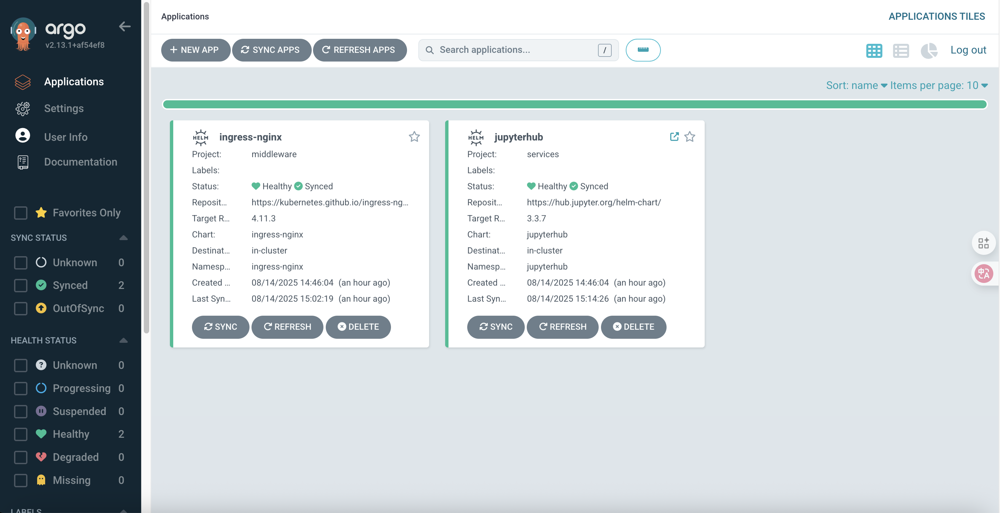
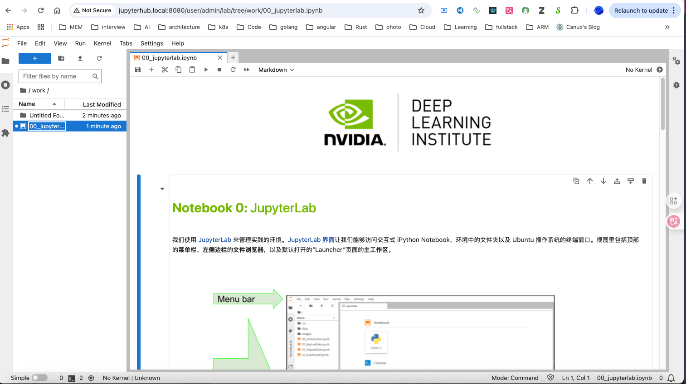

# 🚀 DevOps & AI/ML Platform - Infrastructure as Code

> **Professional-grade GitOps platform for Mac Pro/Studio workstations**  
> Complete Kubernetes development environment with observability, security, and AI/ML capabilities

[](https://kubernetes.io/)
[](https://argo-cd.readthedocs.io/)
[](https://terraform.io/)
[](https://helm.sh/)
[](https://cilium.io/)
[](https://jupyter.org/hub)

## 🎯 Overview

This project provides a **production-ready DevOps and AI/ML platform** designed specifically for Mac Pro and Mac Studio workstations. It enables rapid deployment of enterprise-grade infrastructure on personal hardware, combining modern cloud-native technologies with GitOps principles.

### **Core Value Proposition**

- **🎓 DevOps Learning**: Hands-on experience with production-grade infrastructure patterns
- **🤖 AI/ML Development**: Complete platform for rapid AI tool and model deployment
- **🏠 Private Infrastructure**: Full control over your development environment on personal hardware
- **⚡ Rapid Deployment**: Minutes to production-ready Kubernetes with all essential services

## ✨ Key Features

### 🏗️ **Infrastructure as Code**

- **Terraform**: Complete infrastructure automation
- **Helm Charts**: Standardized application packaging
- **GitOps**: Declarative configuration management with ArgoCD
- **Multi-environment**: Support for development, staging, and production

### 🔒 **Security & Certificate Management**

- **HashiCorp Vault**: Enterprise secrets management with PKI engine
- **Bank-Vaults**: Kubernetes-native secret injection from Vault
- **Cert-Manager**: Automated certificate lifecycle management
- **RBAC**: Role-based access control throughout the stack
- **Network Policies**: Micro-segmentation with Cilium

### 🌐 **Network & DNS Automation**

- **External-DNS**: Automated DNS record management
- **NGINX Ingress**: Advanced load balancing and routing
- **Service Mesh Ready**: Prepared for Istio integration
- **TLS Everywhere**: Automated certificate provisioning

### 📊 **Observability Stack**

- **Prometheus**: Metrics collection and alerting
- **Grafana**: Visualization and dashboards
- **Loki**: Log aggregation and analysis
- **Tempo**: Distributed tracing
- **AlertManager**: Intelligent alerting

### 🧠 **AI/ML Platform**

- **JupyterHub**: Multi-user notebook environment
- **Milvus**: Vector database for AI/ML applications and similarity search
- **GPU Support**: Ready for machine learning workloads
- **Persistent Storage**: Data persistence across sessions
- **Scalable Compute**: Dynamic resource allocation

## 🛠️ Technology Stack

| Component | Purpose | Version |
|-----------|---------|---------|
| **Kind** | Local Kubernetes cluster | Latest |
| **Cilium** | CNI with eBPF networking | Latest |
| **ArgoCD** | GitOps continuous delivery | v2.13+ |
| **NGINX Ingress** | Load balancing and routing | v4.11+ |
| **HashiCorp Vault** | Secrets & PKI management | Latest |
| **Cert-Manager** | Certificate lifecycle | Latest |
| **Bank-Vaults** | Vault-Kubernetes integration | Latest |
| **External-DNS** | DNS automation | Latest |
| **JupyterHub** | AI/ML development environment | v3.3+ |
| **Milvus** | Vector database for AI/ML | v2.6+ |
| **Prometheus Stack** | Monitoring and observability | Latest |

## 🚀 Quick Start

### Prerequisites

- **macOS**: Big Sur (11.0) or later
- **Hardware**: Mac Pro or Mac Studio (Intel/Apple Silicon)
- **Docker Desktop**: Latest version
- **kubectl**: v1.25+
- **Terraform**: v1.5+
- **Helm**: v3.8+

### 1. Clone and Initialize

```bash
git clone https://github.com/crazy-canux/IaC.git
cd IaC
```

### 2. Deploy Infrastructure

```bash
# Deploy Kind cluster with Cilium CNI
cd terraform/kind
terraform init && terraform apply -auto-approve

# Deploy Cilium networking
cd ../cilium
terraform init && terraform apply -auto-approve

# Deploy Vault with PKI engine
cd ../vault
terraform init && terraform apply -auto-approve

# Deploy certificate management and DNS automation
cd ../bank-vaults
terraform init && terraform apply -auto-approve

# Deploy ArgoCD GitOps platform
cd ../argocd
terraform init && terraform apply -auto-approve

# Deploy applications via GitOps
cd ../argocd-apps
terraform init && terraform apply -auto-approve
```

### 3. Configure Local DNS

```bash
# Add local domain entries
echo "127.0.0.1 argocd.local" | sudo tee -a /etc/hosts
echo "127.0.0.1 jupyterhub.local" | sudo tee -a /etc/hosts
echo "127.0.0.1 milvus.local" | sudo tee -a /etc/hosts
```

### 4. Access Services

| Service | URL | Credentials |
|---------|-----|-------------|
| **ArgoCD** | <http://argocd.local:8080> | admin / [get password](#-credentials) |
| **JupyterHub** | <http://jupyterhub.local:8080> | admin, jupyter, user1, user2 / jupyter |
| **Milvus** | <http://milvus.local:8080> | N/A |
| **Milvus WebUI** | <http://milvus.local:8080/webui/> | N/A |

## 📷 Screenshots





## 🔐 Credentials

### ArgoCD Admin Password

```bash
kubectl -n argocd get secret argocd-initial-admin-secret -o jsonpath='{.data.password}' | base64 -d
```

### JupyterHub Users

- **Username**: `admin`, `jupyter`, `user1`, `user2`
- **Password**: `jupyter`

## 🎓 Use Cases

### **🎯 DevOps Skills Development**

- **Production Infrastructure Patterns**: Learn enterprise-grade deployment strategies
- **GitOps Workflows**: Master declarative infrastructure management
- **Security Best Practices**: Hands-on experience with secrets management and PKI
- **Observability**: Complete monitoring and alerting stack implementation

### **🤖 AI/ML Research & Development**

- **Rapid AI Tool Deployment**: Quick setup of ML frameworks and tools
- **Vector Database**: Milvus for efficient similarity search and vector operations
- **Collaborative Research Environment**: Multi-user Jupyter notebooks with shared resources
- **Model Training Infrastructure**: GPU-ready compute with persistent storage
- **AI Pipeline Development**: End-to-end MLOps workflow capabilities

### **🏠 Private Cloud Infrastructure**

- **Personal Development Cloud**: Full-featured Kubernetes on your own hardware
- **Security & Compliance**: Complete control over data and infrastructure
- **Cost-Effective Learning**: No cloud bills for extensive experimentation
- **Mac Pro/Studio Optimization**: Leverages powerful Apple Silicon and Intel hardware

## 🔧 Advanced Configuration

### Vault PKI Integration

The platform includes HashiCorp Vault with PKI engine enabled for automated certificate management:

```bash
# Access Vault after deployment
kubectl port-forward svc/vault -n vault 8200:8200

# Initialize and configure PKI engine
vault auth -method=kubernetes
vault secrets enable pki
vault write pki/config/urls issuing_certificates="https://vault.local/v1/pki/ca"
```

### Certificate Automation

Cert-manager integrates with Vault PKI for automated certificate lifecycle:

```yaml
# Example ClusterIssuer for Vault PKI
apiVersion: cert-manager.io/v1
kind: ClusterIssuer
metadata:
  name: vault-issuer
spec:
  vault:
    server: https://vault.vault.svc.cluster.local:8200
    path: pki/sign/kubernetes
    auth:
      kubernetes:
        mountPath: /v1/auth/kubernetes
        role: cert-manager
```

## 🤝 Contributing

1. Fork the repository
2. Create a feature branch (`git checkout -b feature/amazing-feature`)
3. Commit your changes (`git commit -m 'Add amazing feature'`)
4. Push to the branch (`git push origin feature/amazing-feature`)
5. Open a Pull Request

## 📋 Roadmap

### **🏗️ Infrastructure Components (In Progress)**

- [x] **Kubernetes Platform**: Kind cluster with Cilium CNI
- [x] **GitOps**: ArgoCD for declarative application management
- [x] **Ingress**: NGINX controller with advanced routing
- [x] **AI/ML Platform**: JupyterHub for collaborative development
- [ ] **Secrets Management**: HashiCorp Vault with PKI engine
- [ ] **Certificate Management**: Cert-manager with Vault integration
- [ ] **Secret Injection**: Bank-vaults for Vault-Kubernetes integration
- [ ] **DNS Automation**: External-DNS for dynamic DNS management

### **📊 Observability & Monitoring (Planned)**

- [ ] **Metrics**: Complete Prometheus stack deployment
- [ ] **Visualization**: Grafana with pre-configured dashboards
- [ ] **Logging**: Loki for centralized log aggregation
- [ ] **Tracing**: Tempo for distributed tracing
- [ ] **Alerting**: AlertManager with intelligent routing

### **🤖 AI/ML Ecosystem (Future)**

- [x] **Milvus**: Vector database for AI/ML applications deployed
- [ ] **Kubeflow**: Complete MLOps platform for model training and serving
- [ ] **MLflow**: Model lifecycle management and experiment tracking
- [ ] **Jupyter Enterprise Gateway**: Scalable notebook execution
- [ ] **NVIDIA GPU Operator**: GPU acceleration for AI workloads
- [ ] **Ray**: Distributed computing for large-scale ML
- [ ] **TensorFlow Serving**: Model serving infrastructure
- [ ] **Seldon Core**: Advanced model deployment and monitoring

### **🔧 Advanced Features (Future)**

- [ ] **Service Mesh**: Istio for advanced networking and security
- [ ] **Backup/Restore**: Velero for disaster recovery
- [ ] **Multi-cluster**: Federation for hybrid cloud scenarios
- [ ] **Policy Management**: OPA Gatekeeper for compliance
- [ ] **Image Security**: Trivy for vulnerability scanning

## 📄 License

This project is licensed under the GNU General Public License v3.0 - see the [LICENSE](LICENSE) file for details.

---

> 💡 **Perfect for Mac Pro/Studio Users**: Transform your powerful Apple workstation into a production-grade DevOps and AI/ML platform. Learn enterprise technologies and rapidly deploy AI tools in a completely private, controlled environment.
